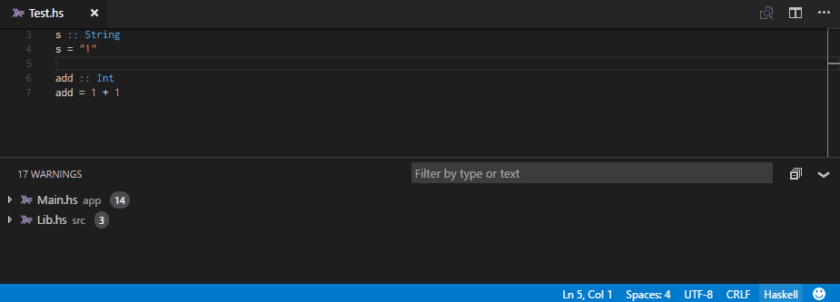
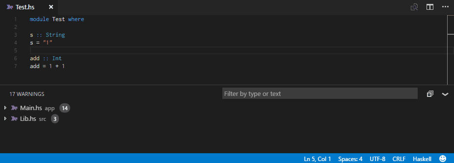
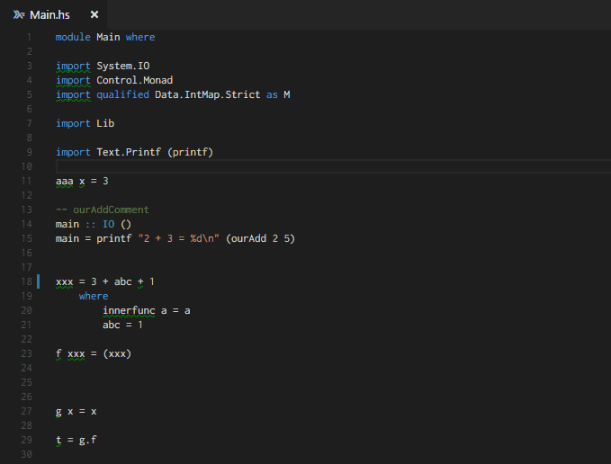
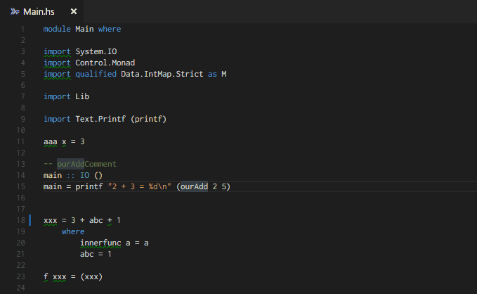

# Haskell for VSCode
Language server for Haskell using [Intero backend](https://github.com/commercialhaskell/intero)

# Features

## GHC Warnings and errors (on save)

> Errors on save

> Warnings on save

## Identifier type definition

> Type definition on hover

## Goto definition

> Goto Identifier definition

# Incoming improvements

- [ ] Better auto completion (support dot notation for qualified imports, ...)
- [ ] Insert identifier type one line above
- [ ] Goto definition in hackage
- [ ] Live evaluation of random hasell code in the current module scope

# Feedback

## Bugs

To fill a bug, go to my gitlab repository, [open an issue](https://gitlab.com/vannnns/VSCode-haskell-intero/issues) and use the following pattern:
> Bug description :

> Observed behaviour :

> Expected behaviour :

> Plugin (ghc, stack, intero and vscode-haskell-intero) version and VSCode version used :

> If the issue is hard to repeat on an empty haskell project, a link to a repository containing a sample reproducing the issue

## Features

To ask for a feature, check if the feature is already requested ([features](https://gitlab.com/vannnns/VSCode-haskell-intero/issues?label_name%5B%5D=Feature) on the gitlab repository).
If not, create a new issue with the *feature requested* label.